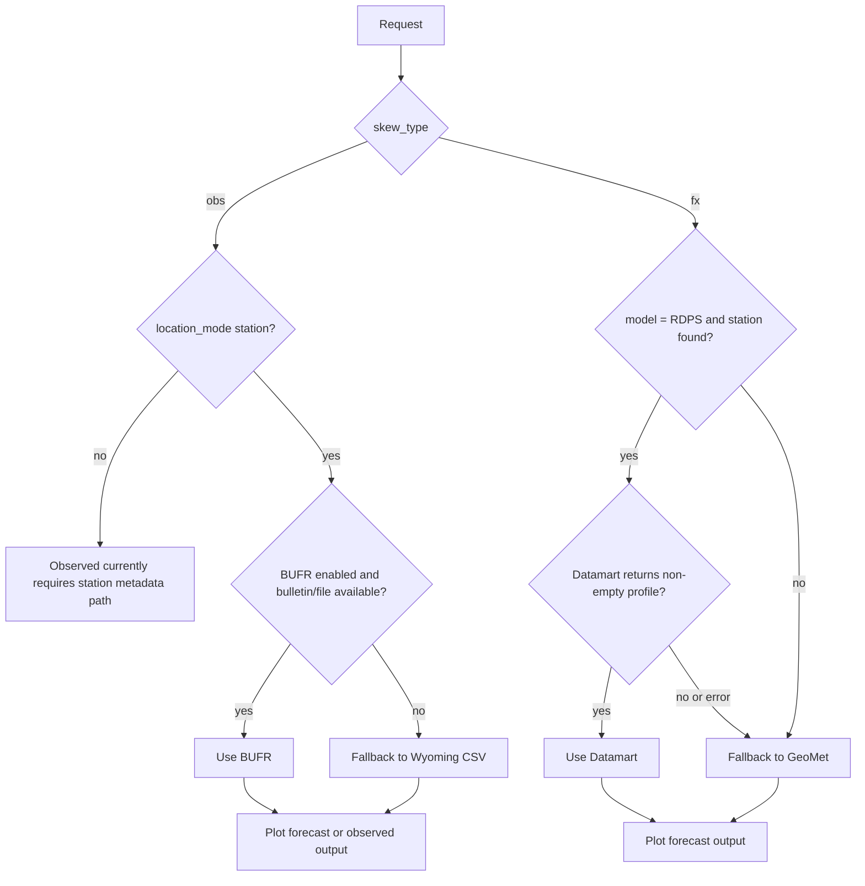

# geomet-ua

Upper-air sounding retrieval and Skew-T plotting workflow for observed and forecast profiles.

The project is now modular, config-driven, and supports clean source fallback for both observations and forecasts.

## What This Tool Does

- Retrieves observed soundings from BUFR with Wyoming fallback.
- Retrieves forecast soundings from Datamart (RDPS station path) or GeoMet.
- Generates Skew-T plots to the figures directory.
- Adds source/elevation metadata to forecast plot subtitles.

## Quick Start

Use the PowerShell wrapper for typical runs.

Observed sounding (station mode):

```powershell
.\plot_ua_wrapper.ps1 -k obs -d 2026-03-19 -H 00 -s CWSE
```

Forecast sounding (model mode):

```powershell
.\plot_ua_wrapper.ps1 -k fx -d 2026-03-19 -H 00 -m GDPS -s CYEG
```

Use a specific config file:

```powershell
.\plot_ua_wrapper.ps1 -k fx -m RDPS -s CYEG -c ua_config.json
```

## Project Structure

- plot_ua_wrapper.ps1: User-facing PowerShell wrapper.
- plot_ua.py: Thin CLI entrypoint.
- ua_config.json: Runtime configuration (paths, endpoints, toggles, defaults).
- ua_core/config.py: Config load and deep merge.
- ua_core/pipeline.py: Request orchestration, fallback logic, logging.
- ua_core/bufr.py: BUFR discovery, retrieval, decode integration.
- ua_core/wyoming.py: University of Wyoming observed profile retrieval.
- ua_core/datamart.py: Datamart RDPS vertical profile retrieval.
- ua_core/geomet.py: GeoMet retrieval and elevation trimming.
- ua_core/stations.py: Station lookup and metadata utilities.
- ua_core/plotting.py: Skew-T rendering and file output.

## Data Source Priority and Fallback

The following flow shows source priority for observed and forecast requests.



## Forecast Plot Metadata (Current Behavior)

Each forecast panel subtitle now includes:

- Station elevation.
- Model elevation.
- Source tag (Datamart, GeoMet, or GeoMet (RDPS fallback)).

Elevation handling rules:

- GeoMet source: model elevation comes from model_surface_elev_dm when available.
- Datamart source: model elevation comes from station_data.csv rdps_elev_m.
- Missing station elevation: resolved through the configured elevation API.
- Missing RDPS model elevation: backfilled via the elevation API.

## Configuration

Main runtime settings are in ua_config.json:

- paths: figures, logs, station file, downloads.
- endpoints: GeoMet, Datamart vertical profile, Wyoming CSV.
- bufr: enabled flag, bulletin list, URL template, timeout.
- elevation_api: enabled flag, endpoint template, timeout.
- defaults: model, hour, forecast time window and step.

## Outputs

- Figures are written to figures/.
- Logs are written to logs/retrieve_soundings.log unless overridden.

Typical forecast output naming:

- SITE_MODEL_fx_YYYYMMDD_HHUTCpNN_skewT.png

Typical observed output naming:

- SITE_obs_YYYYMMDD_HHUTC_skewT.png

## Troubleshooting

### 1) BUFR enabled but still falling back to Wyoming

Symptoms:

- Log shows: BUFR enabled but no bulletin found; falling back to Wyoming.

Checks:

- Confirm BUFR is enabled in ua_config.json.
- Verify requested date/hour is past bulletin release gates.
- Confirm station has BUFR bulletin files for that cycle.

Notes:

- Bulletin filenames include variants such as IUSB01 or IUKB01.
- Matching logic supports these variants and random numeric suffixes.

### 2) RDPS request fails against Datamart (for example HTTP 404)

Symptoms:

- Log shows Datamart retrieval failure.

Current behavior:

- RDPS station requests now automatically fall back to GeoMet.
- Forecast plots should still be generated with source tag GeoMet (RDPS fallback).

### 3) Forecast subtitle shows n/a or 0 m elevations

Checks:

- Ensure elevation_api.enabled is true in ua_config.json.
- Confirm elevation API endpoint is reachable.
- For RDPS station mode, verify rdps_elev_m in station_data.csv.

Current behavior:

- Missing station elevation is backfilled using elevation API.
- Missing RDPS model elevation is also backfilled using elevation API.

### 4) Plot generated but wrong data source suspected

Checks:

- Inspect subtitle Source field on the plot.
- Inspect log entries in logs/retrieve_soundings.log.

Expected source tags:

- Datamart
- GeoMet
- GeoMet (RDPS fallback)
- User file

### 5) Permission or write issues with logs/figures on OneDrive

Symptoms:

- PermissionError when writing logs/retrieve_soundings.log.

Checks:

- Ensure the target file is not locked by another process.
- Re-run with a custom logfile path using wrapper -l.
- If needed, delete/recreate the log file and rerun.
